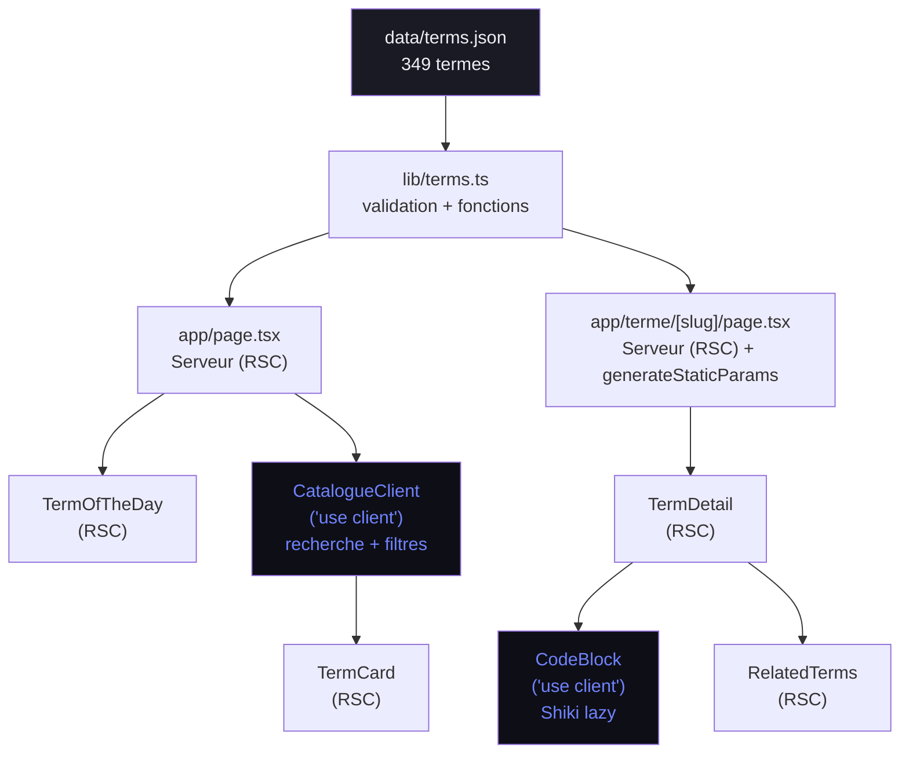

# Architecture

## Vue d'ensemble

Application Next.js 16 entièrement statique (SSG). Les 349 termes sont stockés dans un fichier JSON validé au build. Zéro requête serveur au runtime — toutes les pages sont pré-générées. La recherche et les filtres s'exécutent côté client via `useMemo`.

## Diagramme



## Arborescence

```
LEXIQUE_UNIVERSEL/
├── app/
│   ├── layout.tsx              # Layout racine — fonts, metadata globale, Header
│   ├── page.tsx                # Page d'accueil — TermOfTheDay + CatalogueClient
│   ├── globals.css             # Tokens CSS custom + animations
│   └── terme/
│       └── [slug]/
│           └── page.tsx        # Page terme — SSG, generateStaticParams, generateMetadata
├── components/
│   ├── Header.tsx              # Navigation sticky avec logo
│   ├── CatalogueClient.tsx     # 'use client' — recherche, filtres, alphabet, grille
│   ├── TermCard.tsx            # Carte terme (grille catalogue)
│   ├── TermDetail.tsx          # Vue détaillée d'un terme
│   ├── TermOfTheDay.tsx        # Bannière terme aléatoire du jour
│   ├── CodeBlock.tsx           # 'use client' — coloration Shiki lazy
│   ├── RelatedTerms.tsx        # Liste de liens vers les termes liés
│   ├── NiveauBadge.tsx         # Badge coloré débutant/intermédiaire/avancé
│   └── DomaineBadge.tsx        # Badge domaine avec icône mono
├── lib/
│   ├── types.ts                # Types TypeScript + constantes NIVEAUX / DOMAINES
│   └── terms.ts                # Fonctions données + validation du dataset au build
├── data/
│   └── terms.json              # Source de vérité — 349 termes
├── docs/                       # Documentation projet
└── public/                     # Assets statiques
```

## Flux de données

```
data/terms.json
  → lib/terms.ts (import statique + validateTerms() au module load)
    → getAllTerms()      → page.tsx (home) → CatalogueClient (props)
    → getTermBySlug()   → [slug]/page.tsx → TermDetail (props)
    → getAllSlugs()      → generateStaticParams() → 349 pages statiques
```

## Frontière RSC / Client

| Composant                   | Directive       | Raison                                |
| --------------------------- | --------------- | ------------------------------------- |
| `app/page.tsx`              | Server (défaut) | Lit les données au build              |
| `app/terme/[slug]/page.tsx` | Server (défaut) | SSG, params async                     |
| `CatalogueClient`           | `'use client'`  | useState, useMemo, événements         |
| `CodeBlock`                 | `'use client'`  | import dynamique Shiki, clipboard API |
| Tous les autres composants  | Server (défaut) | Pur rendu, pas d'interactivité        |

## Build strategy

- `generateStaticParams()` dans `[slug]/page.tsx` génère les 349 routes au build
- `npm run build` utilise le flag `--webpack` (Turbopack désactivé — compatibilité Shiki)
- La validation du dataset est exécutée à l'import du module `lib/terms.ts` : un dataset invalide fait planter le build immédiatement avec un message explicite
